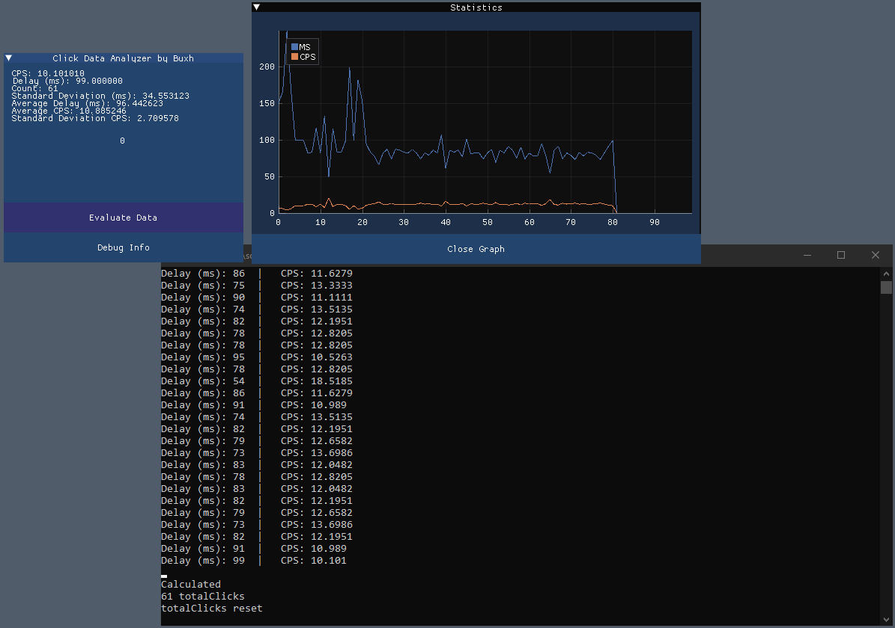

# ClickDataAnalyzer
https://solo.to/buxh

## Disclaimer
I'm a beginner when it comes to programming and by no means good at C++. I'm also aware that the gui looks terrible and that the program has still got a few bugs.

## Download
<!-- BEGIN LATEST DOWNLOAD BUTTON -->

<!-- END LATEST DOWNLOAD BUTTON -->

## Preview

## How to use
Click in the box for about 1-2 minutes then click "Evaluate Data"

## Features
- Ability to view your cps, delay in ms, click count, standard deviation in ms, average delay in ms, average cps & standard deviation cps.
- Debug information of program
- Advanced statistical graph with customizable options to view your click data in futher detail
- Ability to record click data into a .txt file

## To do
- [x] Toggleable CPS and MS lines from graph
- [ ] Create a nicer looking gui
- [ ] Make the program more user friendly
- [ ] Give the option to click in game
- [ ] Give the graph a more modern look

## Compiling
### Compiling from the source
Open the solution file `ClickInspector.sln`, then select `Release | x64` on the Build configuration and press Build solution.

## Is this malware?
For anyone that doesn't know the very basics of C++ and is just here to use the program and is unsure if it is safe I can assure you that everything I put on my github is 100% safe. Here is a [Virustotal link](https://www.virustotal.com/gui/file/a00c35b8da7bf0aa9838c135e0c5980cb8942f97bbe7bd8565c40f55da60bc4a/detection) to show that it is out of harm's way.

## Help
If you are in need of help open an issue or contact me on discord: `paid#1337`
